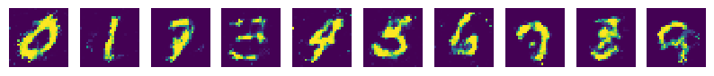

## MNIST dataset


## How to run the code

```bash
$ python3 main.py
```

1. 맨 처음 코드를 작동시킬 경우, 코드는 data 디렉토리를 만들어 MNIST 데이터셋을 다운로드합니다. 

2. 다운로드가 끝나면, 바로 학습이 시작됩니다. 세부 설정은 config.py의 Config 클래스에서 관리합니다.

   ```python
   class Config:
       def __init__(self):
           # device
           self.DEVICE = torch.device("cuda" if torch.cuda.is_available() else "cpu")
   
           # dataset configuration
           self.N_BATCH = 32
   
           # network configuration
           self.N_CLASS = 10
           self.N_IMAGE = 28 * 28
           self.N_NOISE = 128
   
           # training configuration
           self.LR = 1e-3
           self.N_EPOCH = 200
   ```

3. 매 epoch마다 generator가 만드는 숫자 샘플들을 samples 디렉토리에서 확인할 수 있습니다. 

<br/>


## Explanations of the Code lines

#### 0. 라이브러리 로드하기

```python
import torch
import torch.nn as nn
import torch.nn.functional as F
from torch.optim.adam import Adam
from torch.utils.data.dataloader import DataLoader
from torchvision import datasets
from torchvision import transforms as T
from config import Config
from net import Discriminator, Generator
from util import savefig
```

0-1. utils의 `savefig`는 학습 중간에 샘플을 뽑아 이미지로 저장할 수 있게 해줍니다.

<br/>


#### 1. configuration 로드하기

```python
# configurations
cfg = Config()
```

<br/>


#### 2. MNIST 데이터 로드하기

```python
# dataset preparation
transform = T.Compose([T.ToTensor(), T.Normalize(mean=(0.5,), std=(0.5,))])
trainset = datasets.MNIST(root="./data", train=True, download=True, transform=transform)
testset = datasets.MNIST(root="./data", train=False, download=True, transform=transform)

# dataloader preparation
trainloader = DataLoader(dataset=trainset, batch_size=cfg.N_BATCH, shuffle=True, num_workers=4)
testloader = DataLoader(dataset=testset, batch_size=cfg.N_BATCH, shuffle=True, num_workers=4)
```

1-1. 하나의 MNIST 이미지는 1채널(grayscale)의 28*28 사이즈입니다. 한 픽셀은 [0, 255] 사이의 값을 가지는데, 아래와 같이 `ToTensor()`를 사용하면 [0, 1] 사이의 값을 가지게 합니다. 

1-2. 실제 학습에는 [-1, 1] 사이의 값을 가지게 하는 것이 더 좋으므로, `Normalize()`를 이용해 [-1, 1] 사이로 바꿔줍니다. 

1-3. `trainset`과 `testset`에서 직접 데이터를 하나씩 로드해도 괜찮지만, `torch.utils.data`의 `DataLoader`를 사용하면 이를 훨씬 편하게 할 수 있습니다. 

1-4. 여기서는 한 batch 당 100개씩 이미지를 불러오도록 했습니다. 

1-5. `num_worker`는 multi-processing을 사용할 때 코어의 갯수입니다. cpu 코어가 충분히 많다면 값을 올리셔도 좋습니다. 

<br/>


#### 3. Discriminator와 Generator 만들기

```python
class Discriminator(nn.Module):
    def __init__(self, n_input):
        super().__init__()

        self.net = nn.Sequential(
            nn.Linear(n_input, 512),
            nn.LeakyReLU(0.2, inplace=True),
            nn.Linear(512, 1),
            nn.Sigmoid(),  # for true, false discrimination
        )

    def forward(self, x):
        x = self.net(x)
        return x
```

2-1. Discriminator는 이미지가 진짜 이미지(True image)인지 혹은 Generator가 만든 가짜 이미지(Fake image)인지 판단하는 곳입니다. 

2-2. Discriminator의 첫 레이어는 크기가 28*28(이미지 크기) + 10(0부터 9까지 one hot vector의 크기)인 데이터를 인풋으로 줄 것입니다. 

(여기서 이미지에 라벨을 붙이지 않으면 진짜 혹은 가짜인지만 판단하게 되고, 라벨을 붙이면 진짜/가짜인지와 라벨에 맞는 숫자인지까지 판단합니다. 만약 나중에 Generator에서 원하는 숫자를 만들고싶으면, 라벨을 붙여 학습해야합니다.)

(Discriminator에서 라벨을 붙이지 않고 학습하면, Generator에서 라벨을 붙여 학습해도 Generator는 Discriminator에서 진짜/가짜만 통과하는 이미지를 만들기만 하고, 라벨에 맞춰 원하는 숫자를 만들지는 않습니다.)

2-3. Discriminator의 마지막 레이어는 크기가 1인 아웃풋을 주도록 합니다. 이미지가 진짜(1)인지, 가짜(0)인지만 판단하면 되니까요.

```python
class Generator(nn.Module):
    def __init__(self, n_input, n_output):
        super().__init__()

        self.net = nn.Sequential(
            nn.Linear(n_input, 512),
            nn.LeakyReLU(0.2, inplace=True),
            nn.Dropout(0.3),
            nn.Linear(512, n_output),
            nn.Tanh(),
        )

    def forward(self, x):
        x = self.net(x)
        return x
```

2-4. Generator는 노이즈를 받고 Discriminator를 속일 가짜 이미지(Fake image)를 만들어내는 곳입니다.

2-5. Generator의 첫 레이어는 크기가 128(노이즈 크기) + 10(0부터 9까지 one hot vector의 크기)인 데이터를 인풋으로 받습니다.

(어떤 GAN은 one hot vector의 꼬리표를 붙이지 않은 노이즈 데이터만 넣기도 합니다. 이 경우 Generator는 노이즈에 따라서 (거의) 무작위로 숫자를 생성하게 됩니다. 뭐, 사실 그래도 상관 없겠지만, 0부터 9까지 숫자를 원하는 대로 뽑아보고 싶다면 노이즈 끝에 "이 노이즈로 꼬리표에 해당하는 숫자를 만들어줘!"라는 표시로 one hot vector를 붙여야합니다.)

2-6. Generator의 마지막 레이어는 크기가 28*28인 아웃풋(=이미지)을 주도록 합니다.

```python
# network preparation
G = Generator(n_input=cfg.N_NOISE + cfg.N_CLASS, n_output=cfg.N_IMAGE)
D = Discriminator(n_input=cfg.N_IMAGE + cfg.N_CLASS)
```

2-7. 마지막으로, 이제 generator와 discriminator를 정의해줍니다. 

<br/>


#### 4. loss와 optimizer 선택하기

```python
# losses and optimizers
criterion = nn.BCELoss()
G_optim = Adam(G.parameters(), lr=cfg.LR)
D_optim = Adam(D.parameters(), lr=cfg.LR)
```

3-1. 우리는 진짜(1) 혹은 가짜(0)을 판단하는 신경망을 사용하기 때문에, BCE (=Binary Cross Entropy) loss를 사용합니다.

3-2. 학습 속도는 적당한 값을 줍니다. 여러 수치를 테스트해봤는데, 여기서는 0.001정도가 적당히 잘 학습하는 것 같습니다.

<br/>


#### 5. 학습하기

```python
for epoch in range(cfg.N_EPOCH):
    for i, (images, labels) in enumerate(trainloader):
        # get data
        images = images.view(-1, cfg.N_IMAGE)
        labels = F.one_hot(labels, cfg.N_CLASS)
        noises = torch.randn(cfg.N_BATCH, cfg.N_NOISE)
        ...
```

<br/>


## Results (samples)

*epoch 1: 학습 초기에는 대충 중앙에 숫자들이 분포해있다는 정도만 배운 것 같네요.*



*epoch 50: 0부터 9까지 숫자의 형태를 조금 배운 것 같습니다.*


*epoch 150: 점차 형태가 완성된 숫자들이 나오기 시작합니다.*


*epoch 200: 음... 어떤 것은 나아졌는데, 어떤 것은 오히려 안좋아졌네요! 그래도 대충 숫자는 나오네요.*


<br/>


## References

[taeoh-kim's blog: tensorflow로 50줄짜리 original gan code 구현하기](https://taeoh-kim.github.io/blog/tensorflow로-50줄짜리-original-gan-code-구현하기/)

